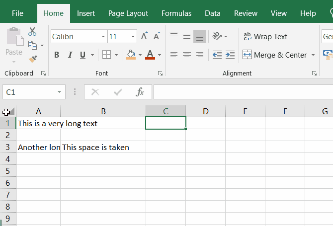

# Excel course

- [Basic topics](#basic-topics)
  - [Change language](#change-language)
  - [Select a range of cells](#select-a-range-of-cells)
  - [Resize rows and columns](#resize-rows-and-columns)
  - [Auto-resize rows and columns](#auto-resize-rows-and-columns)
  - [Add a new line in a cell](#add-a-new-line-in-a-cell)
  - [Wrap text](#wrap-text)
  - [Freeze panes](#freeze-panes)
  - [Merge cells](#merge-cells)
  - [Cell types](#cell-types)
- [Throubleshooting](#throubleshooting)
  - [Having "#####" inside a cell](#having--inside-a-cell)
  - [Unexpected numbers when copy-pasting dates](#unexpected-numbers-when-copy-pasting-dates)
  - [Unexpected warning "There's already data here. Do you want to replace it?" or "This operation will cause some merged cells to unmerge"](#unexpected-warning-theres-already-data-here-do-you-want-to-replace-it-or-this-operation-will-cause-some-merged-cells-to-unmerge)

## Basic topics

### Change language
Using Excel in English is a good idea because it's easier to find help online. To change the language, go to `File > Options > Language` and set the `Display Language` to `English`. Then restart Excel.

### Select a range of cells
In order to **select all cells** in the current sheet, press the small square button in the top left corner of the sheet, between the column and row headers.

`💡 TIP:` _You can also use the keyboard shortcut `Ctrl + A`._

To **select entire rows or columns**, click on the row or column header. To select multiple rows or columns, click on the first row or column header and drag the mouse until satisfied.

To select a **range of cells**, click on the first cell and drag the mouse to the last cell. To select **multiple ranges** of cells, hold the `Ctrl` key while selecting the ranges.

`💡 TIP:` _To expand or shrink the selection, press and hold the `Shift` key while using the arrow keys. Use `Ctrl + Shift + Arrow` to expand the selection to the last non-empty cell._

### Resize rows and columns
To resize rows and columns, hover the mouse on their borders, then click and drag the border to the desired size.

`💡 TIP:` _If you select multiple rows or columns and resize them, they will all be resized to the same size._

### Auto-resize rows and columns
To auto-resize columns, double-click on the right border of the column header. You can also select multiple columns and double-click the border of any of them to resize all.

The same applies to rows.

### Add a new line in a cell
To add a new line in a cell, simply press `Alt + Enter`. To facilitate writing, you can also expand the text box by pressing the arrow on the right side of it. Then drag the lower border to expand vertically.

### Wrap text
If you have a long text inside a cell and you want it to be wrapped according to the cell width, you can use the `Wrap Text` button in the `Home` tab.

### Freeze panes
There are 3 ways to freeze panes:
- Freeze a **custom range**
- Freeze the **first row**
- Freeze the **first column**

To access these options, go to `View > Freeze Panes`. Options are: `Freeze Panes`, `Freeze Top Row`, and `Freeze First Column`.

Two of the options are self-explanatory. To freeze a **custom range** instead, select the first cell of the sheet that you want to move. Now click on `View > Freeze Panes > Freeze Panes`. This will **freeze all rows and columns above and to the left of the selected cell**.

Once frozen, go to `View > Freeze Panes` again, and notice that a new option is available: `Unfreeze Panes`.

### Merge cells
To merge cells, select the cells you want to merge and click on `Home > Merge & Center`. Click it again to unmerge the cells.

### Cell types
There are multiple cell types, each type influences how the cell is displayed to the user. Changing the cell type never changes the value of the cell, what changes is how the value is displayed.

The main cell types are:
- `General`
  - This is the default cell type. It tries to guess the type of the value and display it accordingly.
- `Number`
  - This cell type is used to display numbers. It aligns the numbers to the right and adds a consistent number of decimal places and might add the thousands separator.
  - `💡 TIP:` _To change the number of decimal places, use the `Increase Decimal` and `Decrease Decimal` buttons in the `Home` tab._
  - `💡 TIP:` _Be aware that the fixed number of decimals might hide the true value of the cell because it rounds the value._
- `Currency`
  - This cell type is used to display currency values. It aligns numbers to the right, adds the thousands separator, and the currency symbol.
- `Accounting`
  - This is similar to the `Currency` cell type, but it also aligns the minus sign of negative numbers.
- `Short Date`
  - This displays the date in a short format like `dd/mm/yyyy`. However,  the actual format depends on the language chosen in Excel.
  - `💡 TIP:` _Be aware that, for example, the date `21/07/2014` is internally represented via the number `41841`. Therefore, when copy-pasting dates, if an unexpected number shows up, the problem is probably that the destination cell doesn't have the correct cell type._
- `Long Date`
  - Same as `Short Date`, but the month is spelled out and the day of the week is added.
- `Time`
  - This displays the time in a short format like `hh:mm:ss`. However, the actual format depends on the language chosen in Excel.
- `Percentage`
  - This displays the number as a percentage, with a fixed number of decimal places and a `%` symbol. For example, `0.5` becomes `50%`.
- `Fraction`
  - This displays the number as a fraction. For example, `0.5` becomes `1/2`.
- `Scientific`
  - This displays the number in scientific notation. For example, `100000` becomes `1E+05`.
- `Text`
  - This displays the value as text, without any formatting.
- There is also the possibility to create a **custom cell type** by using special format characters.

`💡 TIP:` _Many of the above formats have a number of possible customizations. Click `More Number Formats` from the cell type dropdown to access them._

-----

## Throubleshooting
### Having "#####" inside a cell
This happens when the cell is too short to display the value. To fix it, simply resize the cell.

### Unexpected numbers when copy-pasting dates
Dates are internally represented via numbers. Therefore, when copy-pasting dates, if an unexpected number shows up, the problem is probably that the destination cell doesn't have the correct cell type.

See also the [Cell types](#cell-types) section.

### Unexpected warning "There's already data here. Do you want to replace it?" or "This operation will cause some merged cells to unmerge"
This might happen when you try to move a range of cells partially over themselves. To avoid the error, first move the selection to an empty space and only then move it to the desired location.
